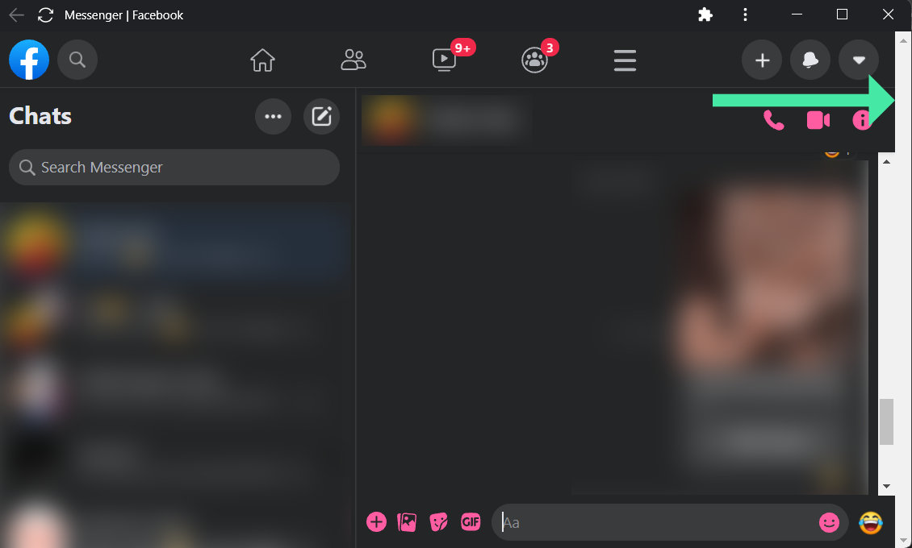
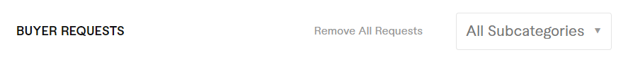
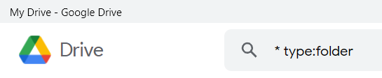
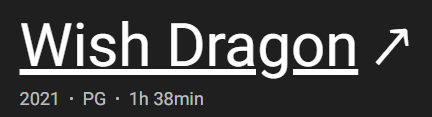
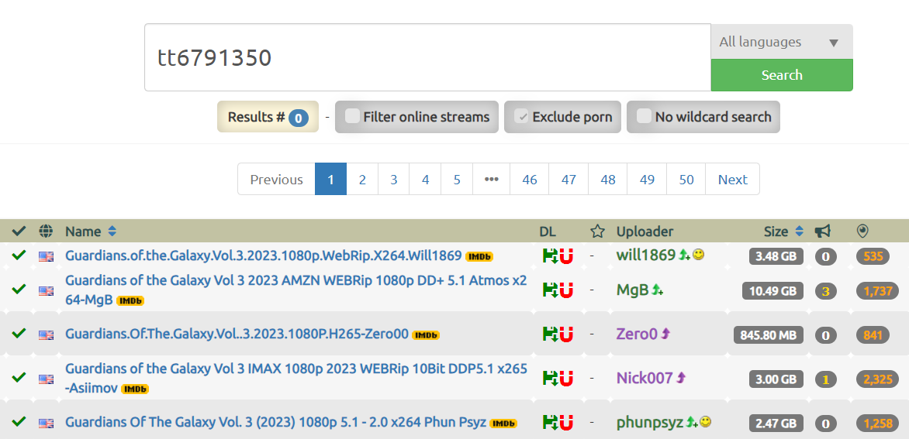

# Userscripts

Collection of some useful userscripts I've written to enhance the user experience of various websites.

| Works On | Script | Preview |
| --- | --- | :---: |
| All website | [Video Speed Control with Keyboard](all-website/video-speed-control-with-keyboard)   Controls any HTML5 video playback speed using keyboard shortcuts. | - |
| [Android Arsenal](https://android-arsenal.com) | [Feed Link to Github Redirection](android-arsenal/feed-link-to-github-redirection)   Redirects the Android Arsenal library links to Github automatically if it is coming from the RSS Feed. | - |
| [Facebook](https://facebook.com) | [Fix Double Scrollbar on Messenger](facebook/fix-double-scrollbar)   Removes the useless additional scrollbar that appears on the full-screen Facebook Chats / Messenger. |  |
| [Fiverr](https://www.fiverr.com) | [Remove All Buyer Requests with One Click](fiverr/remove-all-buyer-requests-with-one-click)   Adds a "Remove All Requests" button on each page of the Buyer Request Table. |  |
| [Google Drive](https://drive.google.com) | [Default Text in Search Field](google-drive/default-text-in-search-field/)   Pre-populate Google Drive search field with some custom text (default: "* type:folder") for easier searching. |  |
| [IMDb](https://imdb.com) | [Link Titles to TorrentGalaxy](imdb/link-titles-to-tgx)   Replaces IMDb post titles with its corresponding TorrentGalaxy catalog link. |  |
| [PSARips](http://psarips.com) | [Add IMDb & TorrentGalaxy link in Post Titles](psarips/add-imdb-n-tgx-link-in-post-titles)   Enhances post titles by adding links to IMDb and TorrentGalaxy. |  |
| | [Dark Mode](psarips/dark-mode/)   Inverted dark mode theme on PSARips. |  |
| [RapidMoviez](http://rmz.cr) | [1080p Release Filter](rapidmoviez/1080p-release-filter/)   Keeps only the 1080p links on release page by filtering out the other links. |  |
| | [Scrollable Popular Movies and TV Shows Section](rapidmoviez/scrollable-popular-movies-and-tv-shows-section/)   Changes the grid style of "Popular Movies and TV Shows" section of RapidMoviez to a scrollable list mimicking the "Latest Episodes" section. |  |
| [TorrentGalaxy](https://torrentgalaxy.to) | [Filter 1080p Releases in IMDb Search](torrentgalaxy/filter-1080p-releases-in-imdb-search)   Keeps only the 1080p releases on the TorrentGalaxy IMDb search page. |  |

## Archived

- [1hack - Hide COUPONS on Homepage](.archive/1hack/hide-coupons-on-homepage)   Hides [COUPON] & [COUPONS] tagged posts on the homepage.
- [Google Drive - Highlight 1080p Releases](.archive/google-drive/highlight-1080p-releases)   Highlights some text ("1080p" by default) in the Google Drive search results.
- [RARBG - 1080p Web Release Filter](.archive/rarbg/1080p-web-release-filter)   Keeps only the 1080p WEB releases on the RARBG TV HD Episodes category.
- [RARBG - Friendly Release Time Format](.archive/rarbg/friendly-release-time-format)   Transforms the default "Added" time format into a human readable relative time format.

## Information

**Author:** [Nissan Ahmed](https://ni554n.github.io) ([@ni554n](https://twitter.com/ni554n))

**Project:** [Homepage](https://github.com/ni554n/userscripts/) / [Support](https://github.com/ni554n/userscripts/issues)

**License:** [MIT](https://github.com/ni554n/userscripts/blob/master/LICENSE)

**Donate:** [PayPal](https://paypal.me/ni554n)

