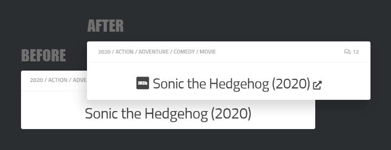
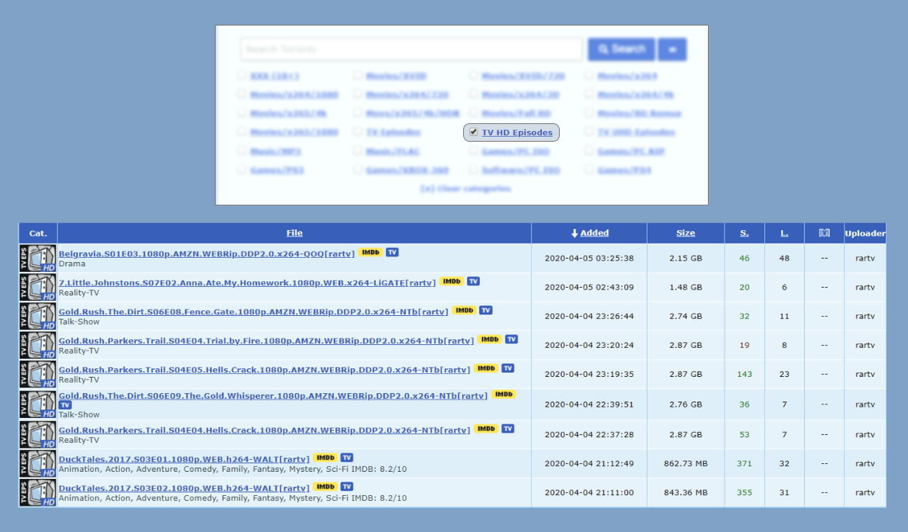
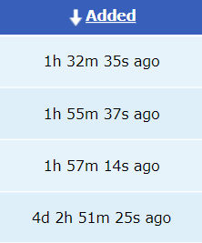

# Userscripts

Collection of some useful userscripts I've written to enhance the user experience of various websites.

| Works On | Script | Preview |
| --- | --- | :---: |
| All website | [Video Speed Control with Keyboard](all-website/video-speed-control-with-keyboard)   Controls any HTML5 video playback speed using keyboard shortcuts. | - |
| [Android Arsenal](https://android-arsenal.com) | [Feed Link to Github Redirection](android-arsenal/feed-link-to-github-redirection)   Redirects the Android Arsenal library links to Github automatically if it is coming from the RSS Feed. | - |
| [Facebook](https://facebook.com) | [Fix Double Scrollbar on Messenger](facebook/fix-double-scrollbar)   Removes the useless additional scrollbar that apprears on the fullscreen Facebook Chats / Messenger. |  |
| [Fiverr](https://www.fiverr.com) | [Remove All Buyer Requests with One Click](fiverr/remove-all-buyer-requests-with-one-click)   Adds a "Remove All Requests" button on each page of the Buyer Request Table. |  |
| [Google Drive](https://drive.google.com) | [Default Text in Search Field](google-drive/default-text-in-search-field/)   Pre-populate Google Drive search field with some custom text (default: "* type:folder") for easier searching. |  |
| | [Highlight 1080p Releases](google-drive/highlight-1080p-releases/)   Highlights some text ("1080p" by default) in the Google Drive search results. |  |
| [IMDb](https://imdb.com) | [Transform Titles into RARBG Links](imdb/transform-titles-into-rarbg-links/)   Replaces the IMDb post titles with the RARBG catalog links. |  |
| [PSARips](http://psarips.com) | [Replace Post Titles with IMDb Links](psarips/replace-post-titles-with-imdb-links/)   Turns a PSARips Movie or TV Show post title into a direct IMDb link or IMDb search link. |  |
| [RapidMoviez](http://rmz.cr) | [1080p Release Filter](rapidmoviez/1080p-release-filter/)   Keeps only the 1080p links on release page by filtering out the other links. |  |
| | [Scrollable Popular Movies and TV Shows Section](rapidmoviez/scrollable-popular-movies-and-tv-shows-section/)   Changes the grid style of "Popular Movies and TV Shows" section of RapidMoviez to a scrollable list mimicking the "Latest Episodes" section. |  |
| [RARBG](https://rarbgto.org) | [1080p Web Release Filter](rarbg/1080p-web-release-filter/)   Keeps only the 1080p WEB releases on the RARBG TV HD Episodes category. |  |
| | [Friendly Release Time Format](rarbg/friendly-release-time-format/)   Transforms the default "Added" time format into a human readable relative time format. |  |

## Archived

- [1hack - Hide COUPONS on Homepage](.archive/1hack/hide-coupons-on-homepage)   Hides [COUPON] & [COUPONS] tagged posts on the homepage.

## Information

**Author:** [Nissan Ahmed](https://ni554n.github.io) ([@ni554n](https://twitter.com/ni554n))

**Project:** [Homepage](https://github.com/ni554n/userscripts/) / [Support](https://github.com/ni554n/userscripts/issues)

**License:** [MIT](https://github.com/ni554n/userscripts/blob/master/LICENSE)

**Donate:** [PayPal](https://paypal.me/ni554n)
